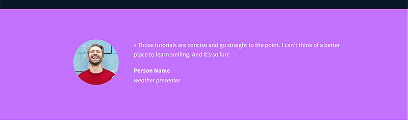

# Figma Smiles Website Project - CSS

The goal of this project is to recreate [this Figma file](https://www.figma.com/file/XrEAsu1vQj5fhVaNG38d2W/Homepage?type=design&node-id=0-1&mode=design), by making a **static** site **with no previous code**, with help from Holberton.

First, we were supposed to create ``../html_advanced/index.html``, which would be an HTML-only version of the Figma site.

In this folder, we must copy the HTML file here, then use CSS, images and fonts to make it look like the file.

## How each final product should look
### Banner

### Quote section

### Tutorials section

### Membership section

### F.A.Q. section (frequently asked questions)

### Footer

